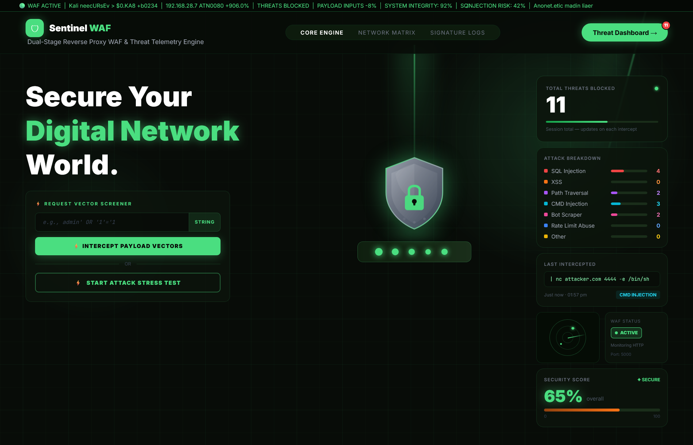
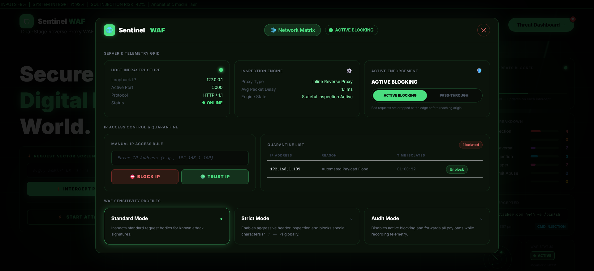
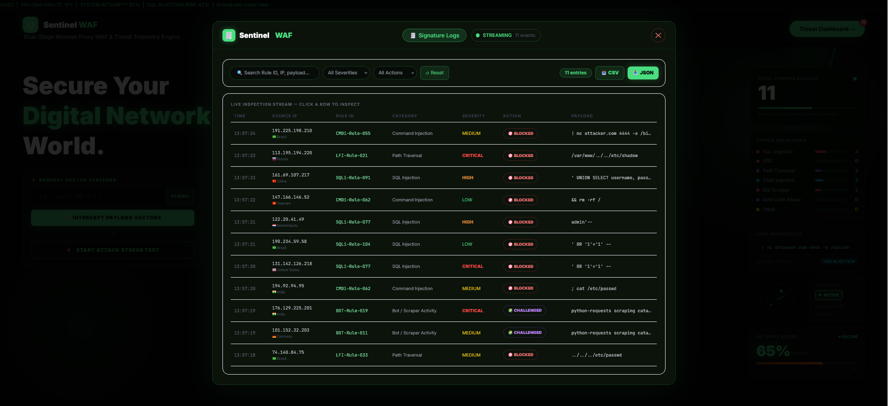
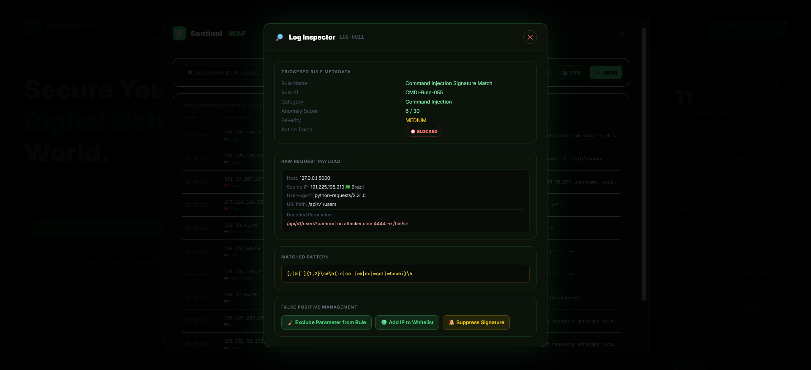
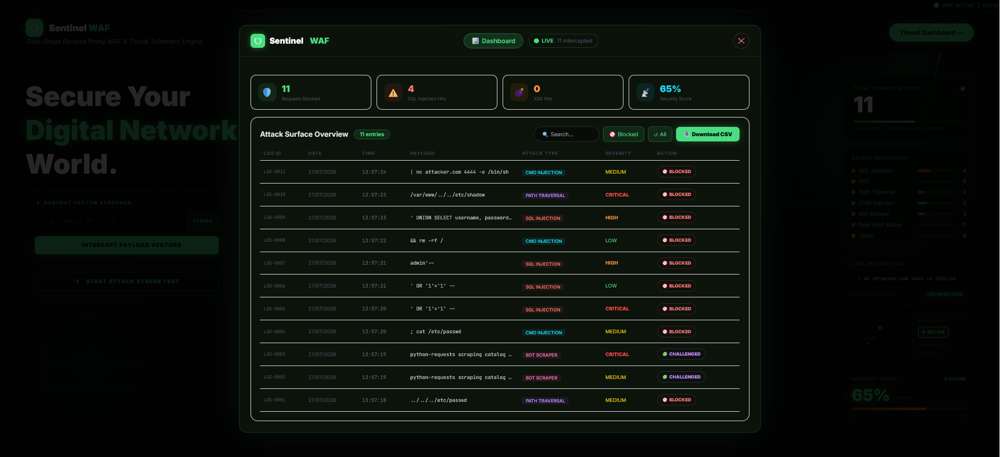

# 🛡️ SentinelWAF

**A Layer 7 Web Application Firewall with hybrid signature + machine-learning detection.**

SentinelWAF sits in front of your application and inspects every incoming request before it reaches your backend. It combines fast, deterministic **signature-based rules** for known attack patterns with a **machine learning anomaly detector** for obfuscated or previously unseen threats — then visualizes everything in a real-time security dashboard.

<p align="center">
  
</p>

---

## Why SentinelWAF

Most student/demo WAFs stop at "does the string contain `<script>`?" SentinelWAF goes further:

- **Multi-pass URL normalization** — payloads are URL-decoded up to 3 times before inspection, so double- and triple-encoded attacks (`%2527` → `%27` → `'`) can't slip past regex rules by hiding behind encoding.
- **Structure-aware signatures, not keyword blocklists** — every rule requires actual attack *syntax* (a quote, an angle bracket, a shell chaining operator), not just a suspicious-sounding word. This is a deliberate design choice to kill false positives: plain input like `"hello"`, `"iphone 15"`, or `"john@example.com"` is verified to always return a clean verdict, because no rule fires on bare English text.
- **ML fallback for the unknown** — anything that isn't a clean pass and isn't a clear signature match gets routed through a trained ML model for anomaly scoring, catching obfuscated payloads signatures alone would miss.
- **Everything routes through one verdict engine** — the dashboard and simulator never guess client-side; all decisions come from a single backend inspection endpoint, so the UI can never show a result the server didn't actually compute.

## How it works

```
Incoming Request
      │
      ▼
Multi-pass URL Normalization  (decode up to 3x)
      │
      ▼
Signature Engine  ──── match ────▶  BLOCKED / CHALLENGED  (logged with rule_id + category)
      │
   no match
      │
      ▼
ML Anomaly Detector  ──── anomalous ────▶  BLOCKED
      │
   clean
      │
      ▼
   PASSED
```

Every verdict — clean or malicious — is persisted with a simulated `source_ip` + GeoIP block, so the dashboard shows realistic, varied telemetry rather than a static placeholder.

## Detection Coverage

| Category | Examples |
|---|---|
| SQL Injection | `' OR '1'='1`, UNION-based extraction, stacked queries |
| Cross-Site Scripting (XSS) | `<script>` tags, `onerror` handlers, encoded/obfuscated payloads |
| Path Traversal | `../../etc/passwd` style directory climbing |
| Command Injection | shell chaining via `;`, `|`, backticks |
| Reconnaissance Probing | scanner/fuzzer fingerprinting patterns |
| ML Anomaly Detection | obfuscated, encoded, or zero-day-style traffic not covered by any signature |

Every request resolves to exactly one of three actions: **PASSED**, **BLOCKED**, or **CHALLENGED**.

## Dashboard

The dashboard is a real-time security console, not just a static log viewer:

- 📊 Live traffic stats and threat category breakdown
- 🌐 Simulated network/GeoIP matrix of request origins
- 🔍 Signature inspection view — see exactly which rule fired and why
- 🧪 Built-in attack simulator covering all six detection categories above, for demoing detection without needing external tools

<p float="left">
    
    
</p>
<p float="left">
    
    
</p>

## Tech Stack

| Layer | Technology |
|---|---|
| Backend | Python, Flask |
| Detection | Regex-based signature engine, scikit-learn / LightGBM ML model |
| Storage | SQLite |
| Frontend | HTML, Tailwind CSS, Chart.js |

## Getting Started

**1. Clone the repository**
```bash
git clone https://github.com/khushisharma20101-design/Sentinel-WAF.git
cd Sentinel-WAF
```

**2. Install dependencies**
```bash
pip install -r requirements.txt
```

**3. Run the application**
```bash
python app.py
```

**4. Open the dashboard**
```
http://localhost:5000/dashboard
```

## Try It Yourself

Use the built-in Request Vector Screener on the dashboard, or hit the API directly:

```bash
curl -X POST http://localhost:5000/api/inspect \
  -H "Content-Type: application/json" \
  -d '{"payload": "'"'"' OR 1=1--"}'
```

**Clean traffic** (should always PASS):
```
hello
iphone 15
john@example.com
```

**Malicious traffic** (should be BLOCKED):
```
' UNION SELECT username, password FROM users--
<script>alert('XSS')</script>
../../../../etc/passwd
```

**Obfuscated traffic** (routed to the ML detector):
```
%27%20OR%20%271%27%3D%271
<details open ontoggle=Function('ale'+'rt(1)')()>
```

## Roadmap

- [ ] Swap simulated GeoIP telemetry for a real feed (e.g. MaxMind)
- [ ] Rate limiting / IP reputation scoring
- [ ] Configurable rule severity thresholds
- [ ] Export threat logs (CSV/JSON)

## License

MIT Licence