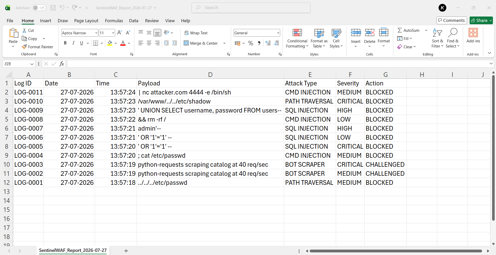

# SentinelWAFinity - Infinite Protection, Intelligent Detection

**SentinelWAFinity** is an Advanced Web Application Firewall (WAF) that protects web applications from known threats such as SQL injection, Cross-Site Scripting (XSS), and other similar attacks by filtering and monitoring HTTP traffic between the application and the Internet.

In addition to signature-based detection, it uses **machine learning-based anomaly detection** to identify obfuscated, zero-day, and previously unknown attacks by analyzing patterns and behaviors in incoming requests.

## Features

- 🚫 Block Known Web Attacks
- 🤖 AI-powered threat detection
- 🛡️ Real-time Request Analysis
- ✨ Modern, Responsive UI
- 📊 Interactive Security Insights
- 🚀 Fast response time


## Output Screenshots

<p float="left">
    
    
</p>

<p float="left">
    
    
</p>
<p float="left">
    
    
</p>

## Tech Stack

| Layer | Technology |
|---|---|
| Backend | Python, Flask |
| Detection | Regex-based signature engine, scikit-learn / LightGBM ML model |
| Storage | SQLite |
| Frontend | HTML, Tailwind CSS, Chart.js |

## Getting Started

**1. Clone the repository**
```bash
git clone https://github.com/khushisharma20101-design/Sentinel-WAF.git
cd Sentinel-WAF
```

**2. Install dependencies**
```bash
pip install -r requirements.txt
```

**3. Run the application**
```bash
python app.py
```

**4. Open the dashboard**
```
http://localhost:5000/dashboard
```

## Try It Yourself

Use the built-in Request Vector Screener on the dashboard, or hit the API directly:

```bash
curl -X POST http://localhost:5000/api/inspect \
  -H "Content-Type: application/json" \
  -d '{"payload": "'"'"' OR 1=1--"}'
```

**Clean traffic** (should always PASS):
```
hello
iphone 15
john@example.com
```

**Malicious traffic** (should be BLOCKED):
```
' UNION SELECT username, password FROM users--
<script>alert('XSS')</script>
../../../../etc/passwd
```

**Obfuscated traffic** (routed to the ML detector):
```
%27%20OR%20%271%27%3D%271
<details open ontoggle=Function('ale'+'rt(1)')()>
```

## Roadmap

- [ ] Swap simulated GeoIP telemetry for a real feed (e.g. MaxMind)
- [ ] Rate limiting / IP reputation scoring
- [ ] Configurable rule severity thresholds
- [ ] Export threat logs (CSV/JSON)

## License

MIT Licence