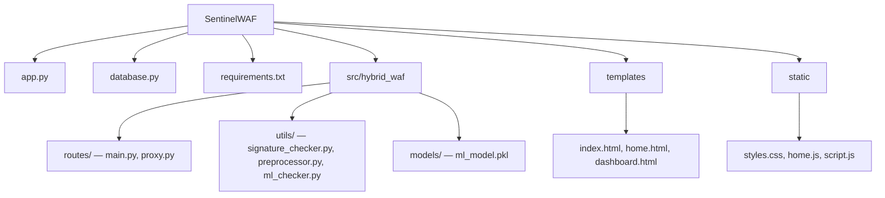
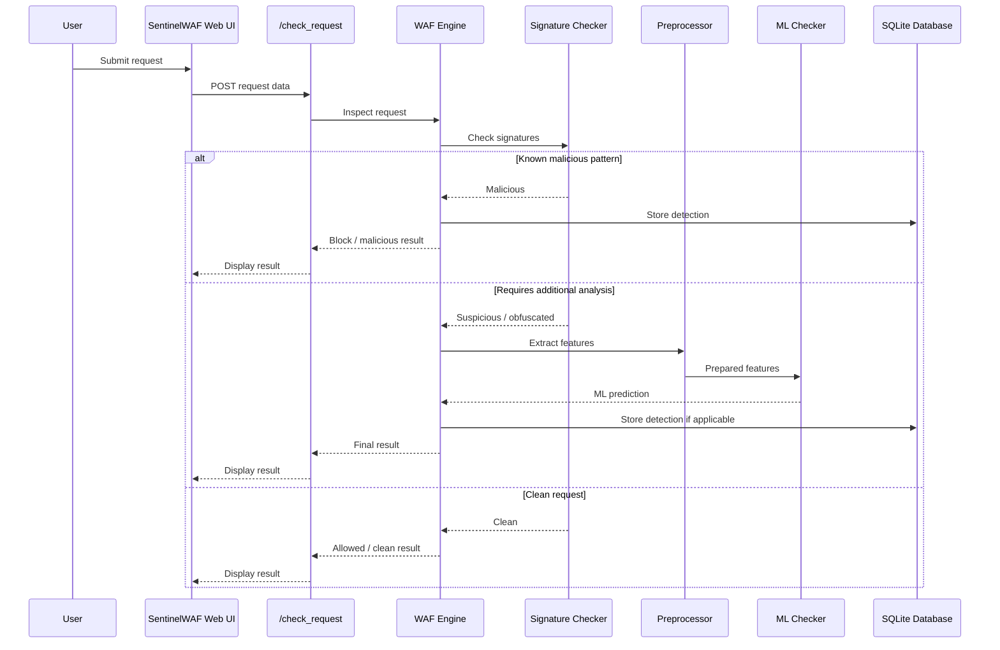
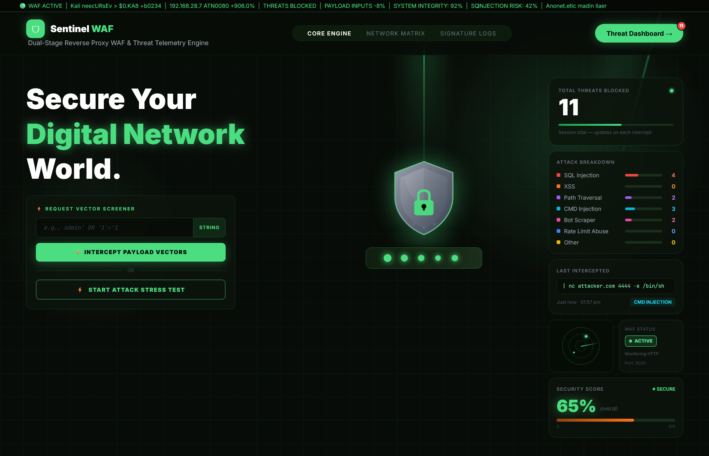
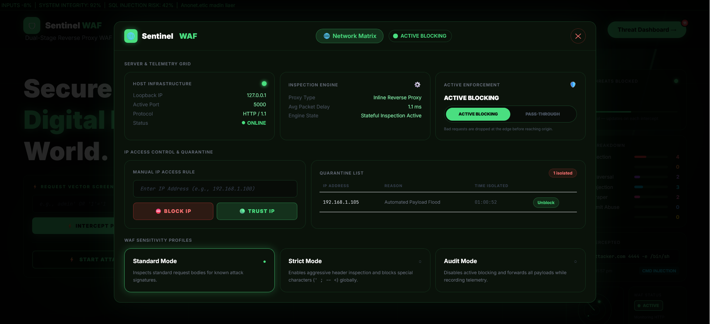
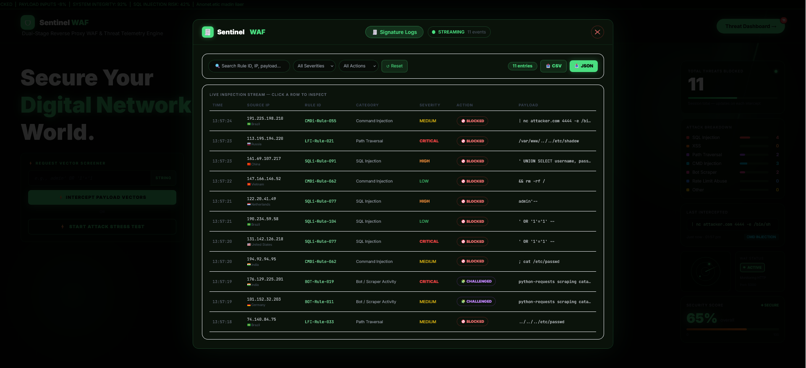
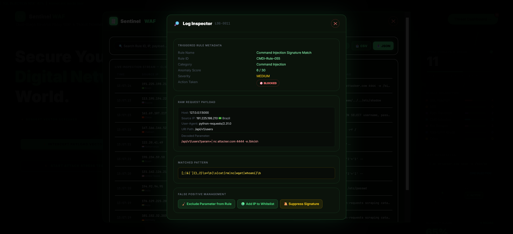
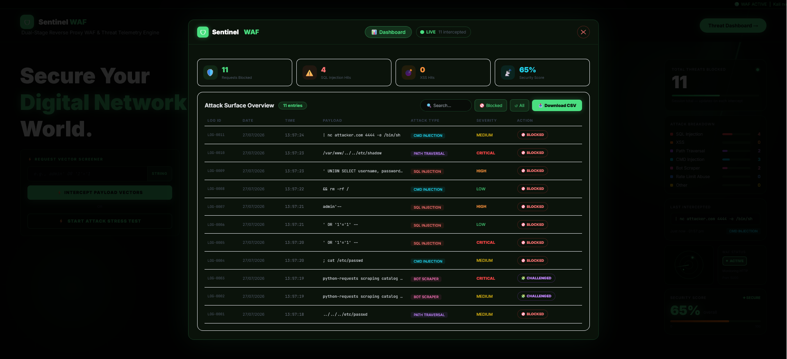
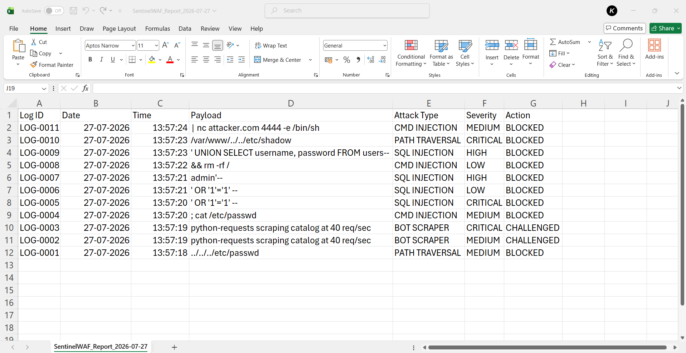

# 🛡 SentinelWAF: Hybrid Signature + ML Web Application Firewall

**Status:** 🟢 Working Prototype  ·  Cybersecurity  ·  Summer Training Project  ·  2026

[](https://github.com/khushisharma20101-design/Sentinel-WAF)
[](#-project-preview)
[](https://www.linkedin.com/in/khushi-sharma-ab9827309)

> **A hybrid web application firewall prototype that combines signature-based detection with machine-learning analysis to inspect web requests, identify known and suspicious attack patterns, and record security events.**

---

## ⚠ Caution & Disclaimers

> **IMPORTANT — EDUCATIONAL USE ONLY**
> This project is built for **EDUCATIONAL AND RESEARCH PURPOSES ONLY**, as part of a cybersecurity summer training project.
> The author is not responsible for any misuse. Testing against systems that you do not own or do not have permission to test is illegal and unethical.

**Notes:**

* The project is intended as a **local cybersecurity demonstration and learning prototype**.
* Attack payloads used during testing are standard examples for demonstrating detection behavior.
* The project should not be considered a production-ready WAF or a replacement for enterprise security infrastructure.
* Local runtime files such as `waf_logs.db`, generated logs, screenshots, and Python cache files are intentionally excluded from version control.

---

## 🛡 Introduction

Modern web applications are continuously exposed to attacks such as SQL Injection, Cross-Site Scripting (XSS), command injection, path traversal, and other malicious request patterns.

A major challenge is that attackers can also modify or obfuscate payloads using URL encoding, hexadecimal encoding, unusual character combinations, comments, and other techniques to make simple pattern matching less effective.

**SentinelWAF** is a hybrid web application firewall prototype designed to demonstrate how two complementary detection approaches can work together:

1. **Signature-Based Detection** — known malicious patterns are checked against predefined security signatures.
2. **Machine-Learning Detection** — requests that require additional analysis can be processed using extracted request features and a trained ML model.

The project provides a Flask-based interface where requests can be submitted for inspection, while the backend coordinates preprocessing, signature analysis, ML analysis, and security logging.

---

## 🚀 Installation & Running

**Requirements:** Python 3.10+ · Virtual Environment recommended

### Step 1 — Clone the Repository

```bash
git clone https://github.com/khushisharma20101-design/Sentinel-WAF.git
cd Sentinel-WAF
```

### Step 2 — Create a Virtual Environment

**Windows PowerShell:**

```powershell
py -m venv .venv
.venv\Scripts\Activate.ps1
```

If Python is available through the `python` command:

```powershell
python -m venv .venv
.venv\Scripts\Activate.ps1
```

### Step 3 — Install Dependencies

```powershell
py -m pip install -r requirements.txt
```

### Step 4 — Initialize the Database

```powershell
py database.py
```

### Step 5 — Run SentinelWAF

```powershell
py app.py
```

### Step 6 — Open the Application

Open the local Flask application in your browser:

```text
http://127.0.0.1:5000/
```

The application provides the web interface for submitting and inspecting requests.

---

## 📊 Folder Structure


```mermaid
graph TD
    Root[SentinelWAF] --> App[app.py]
    Root --> DB[database.py]
    Root --> Req[requirements.txt]
    Root --> Src[src/hybrid_waf]
    Root --> Templates[templates]
    Root --> Static[static]

    Src --> Routes["routes/ — main.py, proxy.py"]
    Src --> Utils["utils/ — signature_checker.py, preprocessor.py, ml_checker.py"]
    Src --> Models["models/ — ml_model.pkl"]
    
    Templates --> Pages["index.html, home.html, dashboard.html"]
    Static --> Assets["styles.css, home.js, script.js"]
```

| Folder / File                               | Role                                                                          |
| ------------------------------------------- | ----------------------------------------------------------------------------- |
| `app.py`                                    | Flask application entry point and blueprint registration                      |
| `database.py`                               | Handles SQLite database initialization and security-event storage             |
| `src/hybrid_waf/routes/main.py`             | Contains the main application/page routes                                     |
| `src/hybrid_waf/routes/proxy.py`            | Handles the request-inspection endpoint and communication with the WAF engine |
| `src/hybrid_waf/engine.py`                  | Coordinates the hybrid detection process                                      |
| `src/hybrid_waf/utils/signature_checker.py` | Performs signature-based inspection of request data                           |
| `src/hybrid_waf/utils/preprocessor.py`      | Prepares request data/features for ML analysis                                |
| `src/hybrid_waf/utils/ml_checker.py`        | Loads the trained ML model and performs ML prediction                         |
| `src/hybrid_waf/models/ml_model.pkl`        | Saved machine-learning model used by the ML detection stage                   |
| `templates/`                                | HTML pages for the application interface and dashboard                        |
| `static/`                                   | CSS and JavaScript assets used by the web interface                           |
| `waf_logs.db`                               | Local SQLite database generated during application runtime                    |

---

## 📌 Project Information

| Category           | Details                                         |
| ------------------ | ----------------------------------------------- |
| Project Name       | SentinelWAF                                     |
| Project Type       | Cybersecurity Web Application                   |
| Domain             | Web Application Firewall / Request Security     |
| Language           | Python 3                                        |
| Backend Framework  | Flask                                           |
| Detection Approach | Signature-Based + Machine Learning              |
| Storage            | SQLite                                          |
| Status             | Working Prototype                               |
| Context            | Summer Cybersecurity Training Project — 45 Days |
| Developed By       | Khushi Sharma                                   |
| Year               | 2026                                            |

---

## 🛠 Technologies & Techniques

| Category            | Technology              | Purpose                                                      |
| ------------------- | ----------------------- | ------------------------------------------------------------ |
| Language            | Python 3                | Core application and detection logic                         |
| Backend             | Flask                   | Web application, routing, and request-inspection API         |
| Detection — Stage 1 | Regex / Signature Rules | Identification of known malicious patterns                   |
| Detection — Stage 2 | Machine Learning        | Additional analysis of suspicious or obfuscated requests     |
| Model Loading       | Joblib                  | Loading the saved ML model                                   |
| Feature Processing  | Custom Preprocessor     | Extracting useful characteristics from request data          |
| Storage             | SQLite                  | Recording security events and detection results              |
| Frontend            | HTML, CSS, JavaScript   | User interface and dashboard                                 |
| Architecture        | Modular Flask Structure | Separation of routes, detection engine, utilities, and model |

### Detection Focus

The signature-based layer is designed to identify common web attack patterns such as:

* SQL Injection
* Cross-Site Scripting (XSS)
* Command Injection
* Path Traversal
* HTML Injection
* Other suspicious request patterns handled by the configured signature rules

The ML stage provides an additional layer of analysis for requests that require more than straightforward signature matching.

---

## ✨ Features & Functions

### 1. 🏠 Web Interface & Request Checker

* Flask-based web interface for interacting with SentinelWAF
* Request input interface for manually testing payloads
* Displays the security decision returned by the WAF
* Provides a simple way to demonstrate clean, suspicious, encoded, and malicious requests

### 2. 🧠 Hybrid Detection Engine

SentinelWAF combines two detection approaches:

**Stage 1 — Signature Inspection**

The submitted request is checked against predefined security signatures. Known malicious patterns can be identified immediately.

**Stage 2 — ML Analysis**

Requests requiring additional analysis are processed by the preprocessing and machine-learning components.

This creates a layered detection approach instead of depending entirely on one detection technique.

### 3. 🔍 Request Preprocessing

Before ML analysis, request information can be transformed into useful features for the trained model.

The preprocessing layer helps convert raw request data into a form that can be evaluated by the ML component.

### 4. 🤖 Machine-Learning Detection

The project includes a saved model:

```text
src/hybrid_waf/models/ml_model.pkl
```

The ML checker loads this model and uses the prepared request features to produce a prediction.

This demonstrates how machine learning can complement traditional signature-based WAF detection.

### 5. 📊 Security Dashboard

The project includes a dashboard interface for presenting WAF activity and security information.

It provides a visual representation of the application's request-inspection and detection functionality.

### 6. 🗄️ Security Event Logging

Detection activity can be stored locally using SQLite.

The database allows the project to retain security-event information so that detection activity can be inspected through the application.

---

## 📈 System Flow


```mermaid
sequenceDiagram
    participant User
    participant UI as SentinelWAF Web UI
    participant Proxy as /check_request
    participant Engine as WAF Engine
    participant Sig as Signature Checker
    participant Prep as Preprocessor
    participant ML as ML Checker
    participant DB as SQLite Database

    User->>UI: Submit request
    UI->>Proxy: POST request data
    Proxy->>Engine: Inspect request

    Engine->>Sig: Check signatures

    alt Known malicious pattern
        Sig-->>Engine: Malicious
        Engine->>DB: Store detection
        Engine-->>Proxy: Block / malicious result
        Proxy-->>UI: Display result

    else Requires additional analysis
        Sig-->>Engine: Suspicious / obfuscated
        Engine->>Prep: Extract features
        Prep->>ML: Prepared features
        ML-->>Engine: ML prediction
        Engine->>DB: Store detection if applicable
        Engine-->>Proxy: Final result
        Proxy-->>UI: Display result

    else Clean request
        Sig-->>Engine: Clean
        Engine-->>Proxy: Allowed / clean result
        Proxy-->>UI: Display result
    end
```

---

## 🔄 Example Detection Scenarios

### Clean Request

A normal request that does not match malicious signatures can be treated as clean.

```text
Hello, how are you?
```

### SQL Injection

A classic SQL injection pattern can be detected by the signature layer.

```text
' OR '1'='1' --
```

### Encoded / Obfuscated Payload

Encoded or modified payloads can require additional analysis instead of relying only on an obvious plaintext signature.

For example:

```text
%27%20OR%20%271%27%3D%271%27%20--%20
```

The payload represents an encoded form of a SQL injection pattern and can be used to demonstrate how obfuscation changes the appearance of an attack.

---

## 📸 Project Preview

<table>
<tr>
<td width="50%"></td>
<td width="50%"></td>
</tr>
<tr>
<td width="50%"></td>
<td width="50%"></td>
</tr>
<tr>
<td width="50%"></td>
<td width="50%"></td>
</tr>
</table>

---

## 🎓 What I Learned & Market Value

**Context:** Built as a 45-day cybersecurity summer training project and developed further as a practical web-security project.

### Learning Outcomes

* Designed a **hybrid security-detection architecture** combining signature rules with machine learning.
* Learned how a WAF can inspect incoming request data before it reaches application logic.
* Implemented a **Flask-based request-inspection API**.
* Worked with modular Flask routes and separated detection components.
* Implemented **request preprocessing and feature extraction** for ML analysis.
* Integrated a saved machine-learning model into a Python web application.
* Implemented **SQLite-based security-event logging**.
* Tested the WAF against clean, malicious, encoded, and obfuscated request examples.
* Learned how traditional signature detection and ML-based detection can complement each other.

### Market Value

Web Application Firewalls are an important component of modern application-security architectures. A hybrid approach demonstrates an understanding of both **deterministic security rules** and **machine-learning-based analysis**, which are useful concepts when studying modern application and SOC security.

---

## 🔮 Future Enhancements

Possible future improvements include:

* Deploying SentinelWAF as an actual reverse-proxy layer between clients and a backend application.
* Adding more comprehensive OWASP-based detection rules.
* Expanding the training dataset for the ML model.
* Improving detection of previously unseen and heavily obfuscated payloads.
* Adding IP-based rate limiting and reputation analysis.
* Adding configurable security rules and severity levels.
* Improving real-time dashboard telemetry.
* Adding stronger production-grade logging and monitoring.
* Integrating the WAF with a real backend application instead of the current request-testing workflow.

---

## 🏷 Tags

`#CyberSecurity` `#WAF` `#Python` `#Flask` `#MachineLearning` `#SQLInjection` `#XSS` `#WebSecurity` `#AnomalyDetection` `#SummerTraining`

---

## ⭐ Support & Engagement

If you find this project useful, please consider:

* ⭐ **Starring** the repository
* 🔁 **Sharing** it within your network
* 👤 **Following** for future projects

— **Khushi Sharma**

[](https://github.com/khushisharma20101-design)
[](https://www.linkedin.com/in/khushi-sharma-ab9827309)
